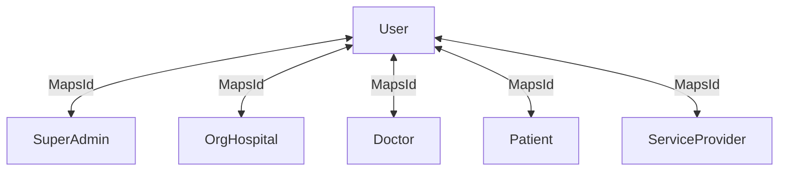
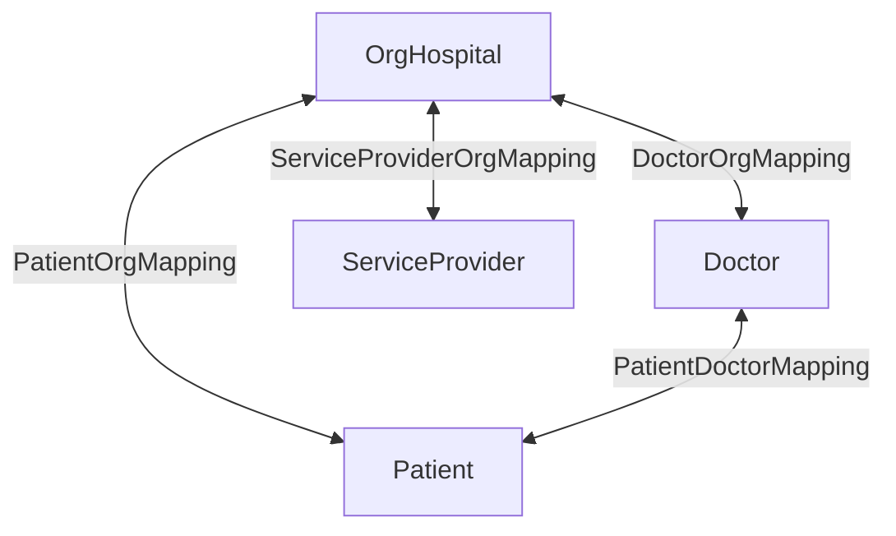
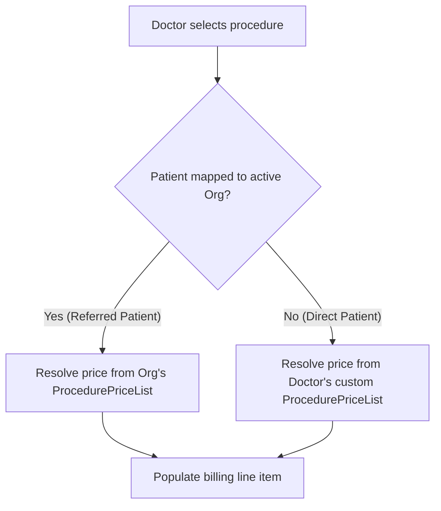

# WORKFLOWS & RELATIONSHIPS: Dizident HMS Multi-Tenant Architecture

This document describes the multi-tenant architecture, database entity relationships, actor roles, and core clinical and administrative workflows in the Dizident Hospital Management System (HMS).

---

## 🎭 1. Roles & Context Boundaries

The system is designed with a multi-level ownership model, allowing organizations, doctors, and service partners to operate independently or link together for B2B referrals.

| Role | Entity / Context | Key Capabilities |
| :--- | :--- | :--- |
| **SUPER_ADMIN** | System Administrator | Manages clinic signups, service providers, database seeding, and global billing records. |
| **ORG_HOSPITAL** | Clinic/Hospital Admin | Manages doctors, vendors, inventories, master catalogs/price lists, and clinic-referred patients. |
| **DOCTOR** | Clinical Practitioner | Practices independently (managing own patients/pricing) AND/OR works within associated clinic organizations. |
| **PATIENT** | Patient Portal | Views clinical visits, prescriptions (Rx), billing statements, and signs consent forms. |
| **SERVICE_PROVIDER** | Service Partner | Manages specific clinical partner departments (Labs, Pathology, Radiology, Pharmacy, Beds, Ambulance, Blood Bank). |

---

## 🔗 2. Database Relationship Mappings (1-to-1 User Extensions)

Dizident HMS implements a **1-to-1 Extension Table Design** to associate system users with specific clinical roles. A single [User](file:///f:/Java%20Spring%20boot/DiziDental/dizidentmain/dev/backend/src/main/java/com/clinic/hms/entity/User.java) table handles authentication, while detail tables store role-specific profile data.

### Profile Extension Classes
- Super Admin details: [SuperAdmin](file:///f:/Java%20Spring%20boot/DiziDental/dizidentmain/dev/backend/src/main/java/com/clinic/hms/entity/SuperAdmin.java)
- Organization Hospital details: [OrgHospital](file:///f:/Java%20Spring%20boot/DiziDental/dizidentmain/dev/backend/src/main/java/com/clinic/hms/entity/OrgHospital.java)
- Doctor profile details: [Doctor](file:///f:/Java%20Spring%20boot/DiziDental/dizidentmain/dev/backend/src/main/java/com/clinic/hms/entity/Doctor.java)
- Patient profile details: [Patient](file:///f:/Java%20Spring%20boot/DiziDental/dizidentmain/dev/backend/src/main/java/com/clinic/hms/entity/Patient.java)
- Service Provider profile details: [ServiceProvider](file:///f:/Java%20Spring%20boot/DiziDental/dizidentmain/dev/backend/src/main/java/com/clinic/hms/entity/ServiceProvider.java)

### Multi-Organization Boundary Mapping
Patient data access and referral boundaries are governed by explicit mapping tables:

- **[DoctorOrgMapping](file:///f:/Java%20Spring%20boot/DiziDental/dizidentmain/dev/backend/src/main/java/com/clinic/hms/entity/DoctorOrgMapping.java)**: Determines which clinics a doctor works at. Mapped via status `ACTIVE` / `INACTIVE`.
- **[PatientOrgMapping](file:///f:/Java%20Spring%20boot/DiziDental/dizidentmain/dev/backend/src/main/java/com/clinic/hms/entity/PatientOrgMapping.java)**: Establishes that a patient is registered at a specific organization/clinic.
- **[PatientDoctorMapping](file:///f:/Java%20Spring%20boot/DiziDental/dizidentmain/dev/backend/src/main/java/com/clinic/hms/entity/PatientDoctorMapping.java)**: Assigns a doctor as the primary care provider for a patient (either independently or under a clinic).
- **[ServiceProviderOrgMapping](file:///f:/Java%20Spring%20boot/DiziDental/dizidentmain/dev/backend/src/main/java/com/clinic/hms/entity/ServiceProviderOrgMapping.java)**: Lists the labs, pharmacies, or radiology partners affiliated with a clinic.

---

## ⚡ 3. Dynamic Price Resolution Flow Chart

Standard clinical procedures are stored in [TreatmentProcedureMaster](file:///f:/Java%20Spring%20boot/DiziDental/dizidentmain/dev/backend/src/main/java/com/clinic/hms/entity/TreatmentProcedureMaster.java), but their pricing depends on the patient's intake context. When a doctor adds a treatment plan procedure, pricing is resolved dynamically in [TreatmentPlanService](file:///f:/Java%20Spring%20boot/DiziDental/dizidentmain/dev/backend/src/main/java/com/clinic/hms/service/TreatmentPlanService.java):

The price resolution logic maps the procedure to a specific [ProcedurePriceList](file:///f:/Java%20Spring%20boot/DiziDental/dizidentmain/dev/backend/src/main/java/com/clinic/hms/entity/ProcedurePriceList.java) associated either with the active clinic's organization ID or the doctor's custom pricing profile.

---

## 🔄 4. Core User Workflows

### 🏥 Workflow A: Clinic & Doctor Onboarding
1. **Super Admin Setup**: Super Admin registers an Organization (gets `ORG-XXXXXX` ID) and invites partner Service Providers (`SP-XXXXXX`).
2. **Staff Invitation**: Org Admin creates a Doctor profile (invitation creates `DOC-XXXXXX` ID and a [DoctorOrgMapping](file:///f:/Java%20Spring%20boot/DiziDental/dizidentmain/dev/backend/src/main/java/com/clinic/hms/entity/DoctorOrgMapping.java) is saved as `ACTIVE`).
3. **Custom Pricing Setup**:
   - Org Admin creates custom pricing for procedures under `/dashboard/billing` -> Master Price List.
   - Doctor logs in, visits their dashboard, and sets independent practice prices.

### 🩺 Workflow B: Clinical Patient Care & Treatment Plans
1. **Intake / Selection**:
   - Org Admin or Doctor registers a patient (creates `PAT-XXXXXX` ID).
   - Doctor selects the patient in the top header selector [HeaderPatientSelector.jsx](file:///f:/Java%20Spring%20boot/DiziDental/dizidentmain/dev/frontend/src/components/layout/HeaderPatientSelector.jsx).
   - This sets the `selectedPatientId` cookie and triggers an immediate `"patient-changed"` window event in the root container [UnifiedDashboard.jsx](file:///f:/Java%20Spring%20boot/DiziDental/dizidentmain/dev/frontend/src/pages/dashboards/UnifiedDashboard.jsx) to sync all open dashboard views.
2. **Examination & Diagnosis**:
   - Doctor schedules a visit or selects an auto-created visit.
   - On the [DiagnosisView.jsx](file:///f:/Java%20Spring%20boot/DiziDental/dizidentmain/dev/frontend/src/pages/DiagnosisView.jsx) page, the doctor fills out the **Odontogram** (selecting involved teeth) and writes clinical exam findings, saving the state to [Visit](file:///f:/Java%20Spring%20boot/DiziDental/dizidentmain/dev/backend/src/main/java/com/clinic/hms/entity/Visit.java).
3. **Treatment Planning**:
   - Doctor goes to [TreatmentPlanView.jsx](file:///f:/Java%20Spring%20boot/DiziDental/dizidentmain/dev/frontend/src/pages/TreatmentPlanView.jsx) and selects category procedures.
   - The backend resolves contract prices (Org contract price vs. Doctor direct rate) via the `resolvePrice` method in [TreatmentPlanService](file:///f:/Java%20Spring%20boot/DiziDental/dizidentmain/dev/backend/src/main/java/com/clinic/hms/service/TreatmentPlanService.java).
   - Doctor clicks **Save Procedure** which logs treatment plan items as [VisitTreatmentItem](file:///f:/Java%20Spring%20boot/DiziDental/dizidentmain/dev/backend/src/main/java/com/clinic/hms/entity/VisitTreatmentItem.java).
   - Doctor prints **Informed Consent** and **Post-Operative Guides** for the patient.

### 💊 Workflow C: Prescription & Medication Orders
1. **Rx Formulation**:
   - Doctor opens [RxSection.jsx](file:///f:/Java%20Spring%20boot/DiziDental/dizidentmain/dev/frontend/src/components/rx/RxSection.jsx). The patient context is automatically loaded from the selected patient cookie.
   - Doctor enters medication names, timing instruction shortcuts (e.g. "once morning" automatically maps to `1 – 0 – 0`), and dosage duration.
   - Doctor can save the prescription as a **Default Rx Template** for fast reuse.
2. **Prescription Dispatch**:
   - Doctor clicks **Save Rx**, locking it to the active clinical visit.
   - [PrescriptionService](file:///f:/Java%20Spring%20boot/DiziDental/dizidentmain/dev/backend/src/main/java/com/clinic/hms/service/PrescriptionService.java) persists [Prescription](file:///f:/Java%20Spring%20boot/DiziDental/dizidentmain/dev/backend/src/main/java/com/clinic/hms/entity/Prescription.java) and [PrescriptionItem](file:///f:/Java%20Spring%20boot/DiziDental/dizidentmain/dev/backend/src/main/java/com/clinic/hms/entity/PrescriptionItem.java) records.
   - The prescription is immediately visible in the **Patient Portal** and referred to partner pharmacies.

### 💳 Workflow D: Billing, Invoicing & Payments
1. **Invoice Generation**:
   - Billing Admin or Doctor loads the billing module.
   - Completed clinical procedures are automatically pulled from [VisitTreatmentItem](file:///f:/Java%20Spring%20boot/DiziDental/dizidentmain/dev/backend/src/main/java/com/clinic/hms/entity/VisitTreatmentItem.java) logs.
   - [BillingService](file:///f:/Java%20Spring%20boot/DiziDental/dizidentmain/dev/backend/src/main/java/com/clinic/hms/service/BillingService.java) generates a new invoice record in the [Bill](file:///f:/Java%20Spring%20boot/DiziDental/dizidentmain/dev/backend/src/main/java/com/clinic/hms/entity/Bill.java) table, with corresponding lines in [BillItem](file:///f:/Java%20Spring%20boot/DiziDental/dizidentmain/dev/backend/src/main/java/com/clinic/hms/entity/BillItem.java).
2. **Receipt Settlement**:
   - Patients can settle the outstanding balance partially or in full.
   - Payment logs are saved in [BillPayment](file:///f:/Java%20Spring%20boot/DiziDental/dizidentmain/dev/backend/src/main/java/com/clinic/hms/entity/BillPayment.java), tracking the settlement method (CASH, CARD, UPI, NEFT, CHEQUE) and updating the billing status to `PAID` or `PARTIALLY_PAID`.

---

## 🧪 5. Seeded Test Credentials (Dev Environment)

The system automatically initializes test accounts via [DataSeeder.java](file:///f:/Java%20Spring%20boot/DiziDental/dizidentmain/dev/backend/src/main/java/com/clinic/hms/config/DataSeeder.java). Use the following credentials to test workflows and access control boundaries:

### 1. Super Admin
- **Mobile**: `9999999999` / **Password**: `admin123` (System administrator control)

### 2. Clinic Organizations (Org Admins)
- **Mobiles**: `8888888801` to `8888888805` / **Password**: `org123`
- **Profiles**: Clinic Org #1 to Clinic Org #5 (`ORG-000001` to `ORG-000005`)

### 3. Doctors
- **Mobiles**: `6666666601` to `6666666605` / **Password**: `doctor123`
- **Profiles**: Doctor #1 to Doctor #5 (`DOC-000001` to `DOC-000005`)
- **Context**: `Doctor #i` is linked to work at `Clinic Org #i` via [DoctorOrgMapping](file:///f:/Java%20Spring%20boot/DiziDental/dizidentmain/dev/backend/src/main/java/com/clinic/hms/entity/DoctorOrgMapping.java).

### 4. Patients
- **Mobiles**: `2222220001` to `2222220010` / **Password**: `patient123`
- **Profiles**: Patient #1 to Patient #10 (`PAT-000001` to `PAT-000010`)
- **Associations**:
  - All patients are linked to **Clinic Org #1** (`ORG-000001`) via [PatientOrgMapping](file:///f:/Java%20Spring%20boot/DiziDental/dizidentmain/dev/backend/src/main/java/com/clinic/hms/entity/PatientOrgMapping.java) for bulk clinical testing.
  - Contextual doctor-patient assignments: **Patient #i** is assigned to **Doctor #i** and **Org #i** (where `i = (patient_index - 1) / 2 + 1`).
    - *Patient 1 & 2* linked to Org 1 & Doctor 1.
    - *Patient 3 & 4* linked to Org 2 & Doctor 2.
    - *Patient 5 & 6* linked to Org 3 & Doctor 3.
    - *Patient 7 & 8* linked to Org 4 & Doctor 4.
    - *Patient 9 & 10* linked to Org 5 & Doctor 5.
