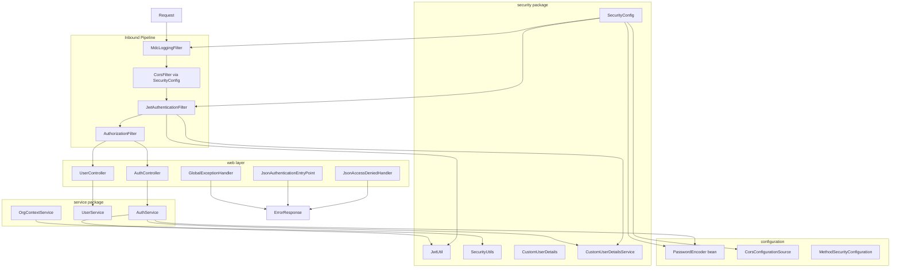

# Logical Components — unit-security-hardening

Infrastructure and application logical components implementing NFR design patterns.

---

## Component Diagram



---

## Component Catalog

### LC-1: MdcLoggingFilter

| Attribute | Value |
|-----------|-------|
| Type | Servlet filter (`OncePerRequestFilter`) |
| Order | Before `SecurityContextHolderFilter` |
| Responsibility | traceId in MDC; request/response timing logs |
| NFR | SECURITY-03, NFR-SEC-08 |

### LC-2: SecurityConfig

| Attribute | Value |
|-----------|-------|
| Type | `@Configuration` |
| Beans | `SecurityFilterChain`, `PasswordEncoder`, `CorsConfigurationSource`, `AuthenticationManager` |
| Responsibility | Wire filter chain, public paths, method security enable |
| NFR | NFR-SEC-01, NFR-SEC-03 |

**New annotations:** `@EnableMethodSecurity` on config or dedicated class.

### LC-3: JwtAuthenticationFilter

| Attribute | Value |
|-----------|-------|
| Type | Servlet filter |
| Dependencies | `JwtUtil`, `CustomUserDetailsService` |
| Input | `hms_token` cookie |
| Output | Populated `SecurityContext` or empty (401 downstream) |

### LC-4: JwtUtil

| Attribute | Value |
|-----------|-------|
| Type | `@Component` |
| Config | `jwt.secret` from environment |
| Operations | generateToken, validateToken, getUsername, getUserId, getRole |

**Code gen action:** Remove or guard default placeholder secret; validate length >= 256 bits for HS256.

### LC-5: CustomUserDetailsService + CustomUserDetails

| Attribute | Value |
|-----------|-------|
| Type | Spring Security adapter |
| Responsibility | Load user by mobile; map role to `ROLE_*` authority |

### LC-6: PasswordEncoder (bean)

| Attribute | Value |
|-----------|-------|
| Type | `DelegatingPasswordEncoder` |
| Default id | `bcrypt` |
| Legacy id | `noop` (transition) |

### LC-7: CorsConfigurationSource (bean)

| Attribute | Value |
|-----------|-------|
| Type | Spring CORS config |
| Property | `app.cors.allowed-origins` |
| Paths | `/api/**`, `/ws/**` |

### LC-8: AuthService

| Attribute | Value |
|-----------|-------|
| Type | `@Service` |
| Methods | authenticate, buildLoginResponse, issueJwtCookie, getOrBootstrapPermissions |
| Transaction | `@Transactional` on login |

### LC-9: UserService

| Attribute | Value |
|-----------|-------|
| Type | `@Service` |
| Methods | listUsers, getPermissions (moved from UserController) |

### LC-10: OrgContextService

| Attribute | Value |
|-----------|-------|
| Type | `@Service` |
| Delegates | `SecurityUtils.getActiveOrgId()` |
| Methods | getActiveOrgId, requireActiveOrgId, validateOrgAccess |

### LC-11: AuthController (refactored)

| Attribute | Value |
|-----------|-------|
| Endpoints | POST login, POST logout (optional) |
| Dependencies | AuthService only (no repositories) |

### LC-12: UserController (refactored)

| Attribute | Value |
|-----------|-------|
| Dependencies | UserService only |
| Security | `@PreAuthorize` class or method level |

### LC-13: GlobalExceptionHandler (extended)

| Attribute | Value |
|-----------|-------|
| New handlers | `AuthenticationException`, `BadCredentialsException`, `AccessDeniedException`, `SecurityException` |
| Response | Existing `ErrorResponse` builder |

### LC-14: JsonAuthenticationEntryPoint (new)

| Attribute | Value |
|-----------|-------|
| Type | `AuthenticationEntryPoint` |
| Trigger | Unauthenticated access to protected resource |
| Response | 401 ErrorResponse JSON with traceId |

### LC-15: JsonAccessDeniedHandler (new)

| Attribute | Value |
|-----------|-------|
| Type | `AccessDeniedHandler` |
| Trigger | `@PreAuthorize` failure |
| Response | 403 ErrorResponse JSON |

### LC-16: LoginRequest validation

| Attribute | Value |
|-----------|-------|
| Annotations | `@NotBlank` mobile, `@NotBlank` password, `@Size` max lengths |
| Trigger | `@Valid` on AuthController.login |

---

## Configuration Components

### application.properties / application.yml keys

```properties
# Security — U1
app.cors.allowed-origins=http://localhost:5173,http://127.0.0.1:5173,http://localhost:3000
app.security.cookie-secure=false
jwt.secret=${JWT_SECRET:}
```

### .env.example entries (code gen)

```text
JWT_SECRET=change-me-min-32-chars-for-hs256
APP_CORS_ALLOWED_ORIGINS=http://localhost:5173,http://127.0.0.1:5173
APP_SECURITY_COOKIE_SECURE=false
```

### Profile: prod (future)

- `app.security.cookie-secure=true`
- `jwt.secret` required non-empty
- Reject placeholder secrets at startup

---

## Components NOT Added in U1

| Component | Reason |
|-----------|--------|
| Redis session store | Stateless JWT |
| API Gateway | Monolith |
| WAF | Out of scope |
| Rate limit filter | Deferred D01 |
| Secrets Manager integration | Local env vars sufficient for dev iteration |

---

## Interaction: Login Path

```text
1. AuthController.login(@Valid LoginRequest)
2. AuthService.authenticate()
   2a. UserRepository.findByMobile
   2b. PasswordEncoder.matches + optional upgradeEncoding
   2c. check isActive
   2d. getOrBootstrapPermissions
   2e. resolve display name by role
3. JwtUtil.generateToken
4. Build ResponseCookie
5. Return ResponseEntity with LoginResponse body
```

---

## Interaction: Protected Request Path

```text
1. MdcLoggingFilter → traceId
2. JwtAuthenticationFilter → SecurityContext (if valid cookie)
3. AuthorizationFilter → authenticated check
4. @PreAuthorize (if present)
5. Controller → Service
6. On failure at 3: JsonAuthenticationEntryPoint → 401
7. On failure at 4: JsonAccessDeniedHandler → 403
```

---

## Dependency Boundaries

| Component | May depend on | Must NOT depend on |
|-----------|---------------|-------------------|
| AuthService | Repositories, JwtUtil, PasswordEncoder | Controllers |
| JwtAuthenticationFilter | JwtUtil, UserDetailsService | Repositories directly |
| SecurityConfig | Filter beans | Business services |
| OrgContextService | SecurityUtils | Controllers |

---

## Handoff to Code Generation

Code generation plan (next stage) should implement components LC-1 through LC-16 in order:

1. PasswordEncoder + SecurityConfig public paths
2. JsonAuthenticationEntryPoint + JsonAccessDeniedHandler
3. AuthService + AuthController refactor
4. UserService + UserController refactor + @PreAuthorize
5. OrgContextService
6. LoginRequest validation
7. JwtUtil secret guard
8. Integration tests NFR-TEST-01/02/03

Infrastructure Design: **skipped** (no cloud resources).
