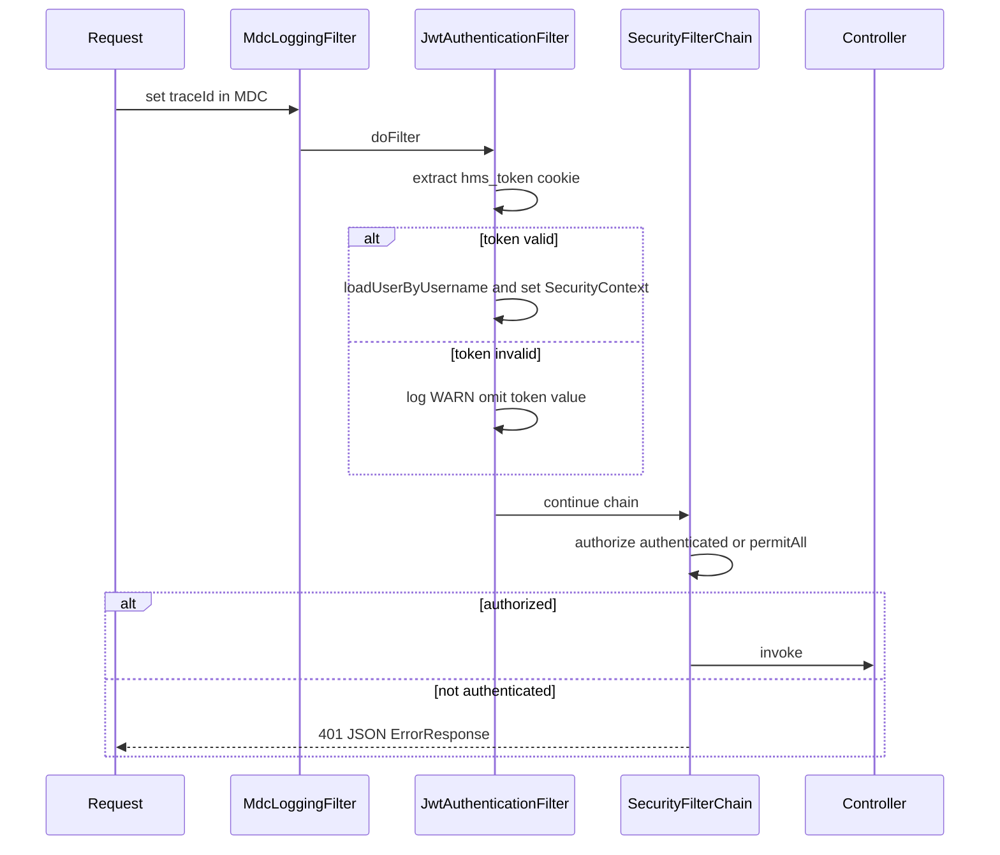

# NFR Design Patterns — unit-security-hardening

Design patterns implementing NFR requirements for U1.

---

## Pattern 1: Deny-by-Default Security Filter Chain

**NFR:** NFR-SEC-01, NFR-AVAIL-01, SECURITY-08, SECURITY-15

**Description:** Spring Security `SecurityFilterChain` requires authentication for all `/api/**` except explicit public allowlist. No fallback to anonymous for protected resources.

**Implementation:**

```text
authorizeHttpRequests:
  permitAll:
    - POST /api/auth/login
    - GET  /actuator/health
    - /swagger-ui/**, /v3/api-docs/**, /swagger-ui.html, /api-docs/**
  anyRequest: authenticated (for /api/**)
  default: authenticated
```

**Fail-closed:** Missing JWT on protected path → 401 before controller invocation.

---

## Pattern 2: JWT Cookie Authentication Filter

**NFR:** NFR-SEC-04, NFR-SEC-10

**Description:** `JwtAuthenticationFilter` (OncePerRequestFilter) extracts `hms_token` cookie, validates signature/expiry, loads `UserDetails`, sets `SecurityContext`.



---

## Pattern 3: Method-Level Authorization

**NFR:** NFR-SEC-05, SECURITY-06, SECURITY-08

**Description:** `@EnableMethodSecurity` enables `@PreAuthorize` on controllers.

| Endpoint group | Annotation pattern |
|----------------|-------------------|
| `UserController` | `@PreAuthorize("hasAnyRole('SUPER_ADMIN','ORG_HOSPITAL')")` (tune to match existing admin behavior) |
| `POST /api/auth/login` | Public — no annotation |
| Other controllers in U1 | Authenticated only — role checks expanded in U2 |

**403 response:** Spring `AccessDeniedException` → handler returns 403 ErrorResponse.

---

## Pattern 4: Delegating Password Encoder with Upgrade

**NFR:** NFR-SEC-02, SECURITY-12

**Description:** `PasswordEncoder` bean uses `PasswordEncoderFactories.createDelegatingPasswordEncoder()` or equivalent custom bean:

```text
encode(newPassword) -> {bcrypt}$2a$10$...
matches(raw, stored):
  - if stored has no prefix: treat as {noop} for match attempt
  - on success with legacy: AuthService re-encodes with bcrypt and saves
```

**Idempotence:** Already-BCrypt passwords not re-encoded (NFR-PERF-04 / PBT).

---

## Pattern 5: Environment-Driven CORS Allowlist

**NFR:** NFR-SEC-03, SECURITY-08

**Description:** Parse CSV property into `CorsConfiguration.setAllowedOrigins()` — never `*`.

| Environment | Origins |
|-------------|---------|
| Dev default | localhost:5173, 127.0.0.1:5173, localhost:3000 |
| Docker | Add frontend container origin via env |
| Production | Client-specific domains from env |

**Preflight:** OPTIONS handled by CORS filter before auth.

---

## Pattern 6: Structured Security Logging (MDC)

**NFR:** NFR-SEC-08, SECURITY-03

**Description:** `MdcLoggingFilter` binds `traceId` before security filters. Auth events log:

- Login failure: WARN, no password, no full token
- Access denied: WARN with uri + traceId
- Request/response: INFO with duration (existing)

**Excluded from logs:** Cookie values, Authorization headers, request bodies on login.

---

## Pattern 7: Unified API Error Response

**NFR:** NFR-SEC-07, NFR-SEC-11, SECURITY-09, SECURITY-15

**Description:** Extend `GlobalExceptionHandler` + add `AuthenticationEntryPoint` / `AccessDeniedHandler` for JSON consistency.

**ErrorResponse schema (existing):**

| Field | Type | Example |
|-------|------|---------|
| timestamp | ISO string | 2026-07-02T21:00:00 |
| status | int | 401 |
| error | string | Unauthorized |
| message | string | Invalid mobile or password |
| path | string | /api/auth/login |
| traceId | string | uuid |
| validationErrors | map | optional |

**Auth-specific messages:**

| HTTP | message (user-facing) |
|------|----------------------|
| 401 | Invalid mobile or password / Authentication required |
| 403 | User is inactive / Access denied |
| 400 | X-Active-Org-Id header is missing... |

Stack traces never in response body (existing generic 500 message).

---

## Pattern 8: Org Context Facade

**NFR:** NFR-SEC-13, SECURITY-08

**Description:** `OrgContextService` wraps `SecurityUtils.getActiveOrgId()` — single injection point for services added in U1/U2.

**Fail-closed:** Invalid org mapping → `SecurityException` → 403, not silent null.

---

## Pattern 9: Defense in Depth (U1 layer)

**NFR:** NFR-SEC-12, SECURITY-11

```text
Layer 1: CORS origin restriction
Layer 2: JWT presence + validity (filter)
Layer 3: Spring Security authenticated() rule
Layer 4: @PreAuthorize role check (admin endpoints)
Layer 5: OrgContextService (org-scoped operations — U2 expands)
```

---

## Pattern 10: Configuration Externalization

**NFR:** NFR-SEC-09, SECURITY-09

| Secret/config | Pattern |
|---------------|---------|
| JWT secret | `@Value("${jwt.secret}")` — no production default |
| CORS origins | `app.cors.allowed-origins` property |
| Cookie secure | `app.security.cookie-secure` boolean |

**Startup validation (prod profile):** If `jwt.secret` equals known placeholder → fail fast with clear message.

---

## Resilience Patterns

| Pattern | Application | N/A rationale |
|---------|-------------|---------------|
| Retry | Not on login/auth | Fail fast; user retry |
| Circuit breaker | Not in U1 | Monolith local |
| Bulkhead | Not in U1 | Single service |
| **Fail-closed** | **Yes** | Core auth pattern |
| **Transactional login** | **Yes** | Password upgrade atomicity |

---

## Performance Patterns

| Pattern | Application |
|---------|-------------|
| Stateless JWT | No session store lookup except UserDetails load |
| One-time permission bootstrap | Cache in DB after first login |
| BCrypt strength 10 | Fixed cost per login |
| Filter early exit | Invalid token skips UserDetails load if parse fails |

**Not in U1:** UserDetails cache, rate limiting (deferred D01).

---

## Scalability Patterns

| Pattern | Application |
|---------|-------------|
| Stateless authentication | Enables future horizontal pod scaling |
| JWT in cookie | No sticky sessions required |

---

## Security Compliance Summary (Design Level)

| Rule | Pattern |
|------|---------|
| SECURITY-03 | Pattern 6 |
| SECURITY-05 | Pattern 7 + `@Valid` |
| SECURITY-08 | Patterns 1, 2, 3, 5 |
| SECURITY-09 | Pattern 7, 10 |
| SECURITY-11 | Pattern 9 |
| SECURITY-12 | Pattern 4, cookie attrs |
| SECURITY-15 | Pattern 1, 7 |

**Deferred patterns:** Rate limiting (D01), MFA (D02), centralized alerting (D05).

---

## Test Pattern Mapping

| NFR-TEST ID | Pattern verified |
|-------------|------------------|
| NFR-TEST-01 | Patterns 2, 4, 7 |
| NFR-TEST-02 | Pattern 1 |
| NFR-TEST-03 | Pattern 4 |
| NFR-TEST-04 | Pattern 7 (DTO round-trip) |
