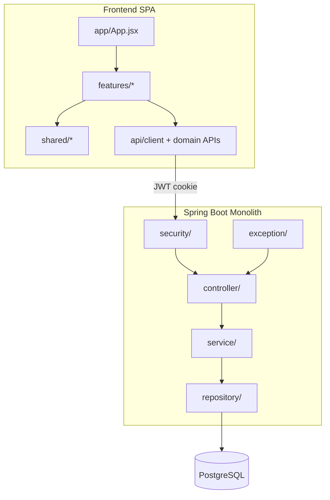

# Application Design — DiziDental Dev Hardening

Consolidated application design for the code quality and security hardening iteration.

**Related artifacts:**
- [components.md](./components.md)
- [component-methods.md](./component-methods.md)
- [services.md](./services.md)
- [component-dependency.md](./component-dependency.md)
- [application-design-plan.md](../plans/application-design-plan.md)

---

## Design Summary

This iteration hardens a **monolithic Spring Boot + React SPA** without changing deployment topology or API contracts. Design focus:

1. **Security first** — enforce JWT, BCrypt, CORS, method security
2. **Service layer completion** — 12 controllers currently bypass services; extract 7 new services
3. **Org scoping** — central `OrgContextService` for SEC-005
4. **Frontend feature modules** — comprehensive restructure preserving routes and WowDash UI

Backend packages stay flat (`controller/`, `service/`, `repository/`) per moderate scope (Q8). Frontend moves to `features/` + `shared/` + `app/` layout (Q9).

---

## Architecture Overview



---

## Backend Logical Components

| ID | Component | Controllers | Priority |
|----|-----------|-------------|----------|
| BC-1 | Security & Auth | Auth, User | P0 |
| BC-2 | Org Context | (cross-cutting) | P0 |
| BC-3 | Clinical Core | Patient, Visit, Appointment, TreatmentPlan, Prescription | P1 |
| BC-4 | Billing & Reports | Billing, RevenueReport, PatientReport, AppointmentReport | P1 |
| BC-5 | Operations | Inventory, Vendor, Lab, Event, Masters | P2 |
| BC-6 | Administration | Organization, Doctor, ServiceProvider | P1 |
| BC-7 | Communication | Chat, ChatWebSocket | P2 |

---

## New Backend Services

| Service | Replaces direct repo in |
|---------|-------------------------|
| `AuthService` | `AuthController` |
| `UserService` | `UserController` |
| `OrgContextService` | (new cross-cutting) |
| `OrganizationService` | `OrganizationController` |
| `RevenueReportService` | `RevenueReportController` |
| `PatientReportService` | `PatientReportController` |
| `AppointmentReportService` | `AppointmentReportController` |

---

## Security Design

| Area | Current | Target |
|------|---------|--------|
| API authorization | `permitAll` on `/api/**` | JWT required except login, health, swagger |
| Password storage | `NoOpPasswordEncoder` | BCrypt via `DelegatingPasswordEncoder`; rehash on login |
| CORS | `*` with credentials | Env allowlist (`CORS_ALLOWED_ORIGINS`) |
| Role checks | None enforced | `@PreAuthorize` on controllers/services |
| Org scoping | Header trusted | `OrgContextService.validateOrgAccess()` |

---

## Frontend Target Structure

```text
frontend/src/
  app/                    App.jsx, routes, providers
  api/
    client.js             Base Axios (from api.js)
    authApi.js
    patientApi.js
    ...                   One module per domain
  features/
    auth/
    patient/
    doctor/
    org/
    admin/
    provider/
    clinical/
    billing/
    inventory/
    schedule/
    reports/
    chat/
    dashboard/
  shared/
    components/           layout, common, print, odontogram, clinical
    hooks/
    utils/
  assets/                 CSS unchanged
  config.js               Unchanged
```

Each `features/{name}/` contains `pages/`, optional `components/`, `hooks/`, and optional thin `services/`.

---

## Layering Enforcement Rules

1. Controllers MUST NOT inject repositories (except during migration — remove by end of layering unit).
2. Services MUST call `OrgContextService` for org-scoped operations.
3. DTOs remain the API contract boundary — entities never returned directly from controllers.
4. `@Valid` on request DTOs at controller layer; business validation in services.

---

## Mapping to Construction Units

| Unit | Components affected |
|------|---------------------|
| `unit-security-hardening` | BC-1, BC-2, SecurityConfig, AuthService, UserService (auth paths) |
| `unit-backend-controller-audit` | All 22 controllers — findings and critical/high fixes |
| `unit-backend-layering` | BC-3 through BC-7 — service extraction, repo removal from controllers |
| `unit-frontend-restructure` | FC-1 through FC-4 — folder moves, api modules, hooks |

---

## Extension Compliance Notes

| Extension | Application Design action |
|-----------|----------------------------|
| Security Baseline | Workload classification documented; auth and org scoping designed |
| Resiliency Baseline | Criticality matrix in components.md; dependency map in component-dependency.md |
| PBT | Identified round-trip candidates: DTO serialization, LoginResponse mapping (detailed in Functional Design) |

---

## Out of Scope (design)

- Microservice decomposition
- New REST endpoints or DTO shape changes
- Database schema migrations
- Client folder (`clientabc/`, `clientxyz/`) changes
- Infrastructure/CDK design (Infrastructure Design skipped)

---

## Next Stage

**Units Generation** — decompose into four construction units with dependency matrix and story mapping (requirements FR IDs as traceability source in lieu of user stories).
