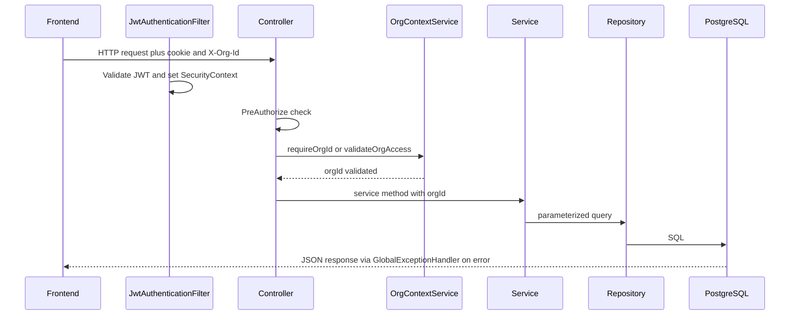
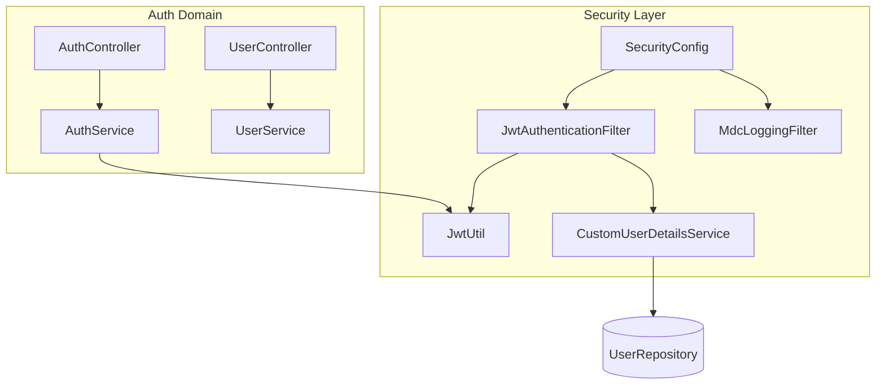

# Component Dependencies

Dependency relationships and communication patterns for the hardened architecture.

---

## Backend Dependency Matrix

| From | To | Relationship | Notes |
|------|-----|--------------|-------|
| All Controllers | Domain Services | uses | No direct repository injection |
| All org-scoped Services | OrgContextService | uses | Validates org access |
| AuthController | AuthService | uses | Thin HTTP adapter |
| UserController | UserService | uses | Thin HTTP adapter |
| AuthService | UserRepository, JwtUtil, PasswordEncoder | uses | Login orchestration |
| AuthService | Role repos (Patient, Doctor, etc.) | uses | Display name resolution |
| SecurityFilterChain | JwtAuthenticationFilter | filters | Before UsernamePasswordAuthenticationFilter |
| JwtAuthenticationFilter | JwtUtil, CustomUserDetailsService | uses | Populate SecurityContext |
| Services | Repositories | uses | JPA data access |
| Repositories | Entities | maps | Spring Data JPA |
| ChatWebSocketController | JwtUtil / SecurityContext | uses | Auth on connect |
| GlobalExceptionHandler | — | cross-cutting | All controllers |

---

## Layer Dependency Rules (enforced)

```text
controller  -->  service  -->  repository  -->  entity
     |              |
     +--> dto       +--> OrgContextService (cross-cutting)
     
security  -->  controller (filter chain, @PreAuthorize)
exception -->  controller (@RestControllerAdvice)
```

**Forbidden after hardening:** `controller --> repository`

---

## Backend Data Flow — Authenticated Request



---

## Security Component Dependencies



---

## Frontend Dependency Matrix

| From | To | Relationship |
|------|-----|--------------|
| `app/App.jsx` | Feature pages | routes |
| Feature pages | Feature hooks | uses |
| Feature hooks | `api/{domain}Api.js` | uses |
| Domain API modules | `api/client.js` | uses |
| `api/client.js` | Backend REST | HTTP |
| Shared components | Shared utils/hooks | uses |
| All features | `shared/components/layout` | uses |

---

## Target Frontend Structure Dependencies

```text
app/App.jsx
  --> features/auth/pages/LoginPage
  --> features/dashboard/pages/UnifiedDashboard
  --> features/patient/pages/*
  --> features/doctor/pages/*
  --> ... (other features)

features/patient/hooks/usePatient.js
  --> api/patientApi.js
  --> api/client.js

shared/components/layout/WowDashLayout.jsx
  --> shared/hooks/useOrgContext.js
  --> api/client.js
```

**Route paths unchanged** — only import paths update during restructure.

---

## Cross-System Integration Points

| Integration | Protocol | Auth | Change in iteration |
|-------------|----------|------|---------------------|
| Frontend to REST API | HTTPS/HTTP | JWT cookie | Enforced server-side |
| Frontend to WebSocket | STOMP | JWT cookie | Align with REST auth |
| Backend to PostgreSQL | JDBC/TLS | DB credentials | No schema change |
| Swagger UI | HTTP | Optional auth per SEC-004 | Defer or restrict |

---

## Construction Unit Dependencies

```text
unit-security-hardening
  --> blocks all other units

unit-backend-controller-audit
  --> depends on unit-security-hardening
  --> feeds findings into unit-backend-layering

unit-backend-layering
  --> depends on audit completion for critical/high fixes

unit-frontend-restructure
  --> depends on hardened backend for integration testing
  --> can start structure moves in parallel with layering if imports stable
```

---

## External Dependencies (unchanged)

| Dependency | Version context | Impact |
|------------|-----------------|--------|
| Spring Boot 4 | Backend | Security config API |
| Spring Security | JWT filter chain | Method security enable |
| React 19 + Vite 7 | Frontend | Import path updates only |
| PostgreSQL | Database | No migration for BCrypt (migrate-on-login) |
| Axios | Frontend HTTP | Cookie withCredentials unchanged |
