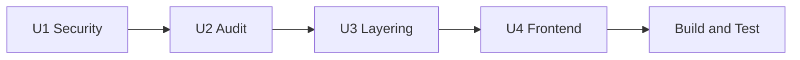

# Unit of Work Dependency Matrix

Dependency relationships between construction units and external systems.

---

## Unit Sequence (mandatory)

```text
U1 unit-security-hardening
  |
  v
U2 unit-backend-controller-audit
  |
  v
U3 unit-backend-layering
  |
  v
U4 unit-frontend-restructure
  |
  v
Build and Test
```

**Rule:** No unit N+1 code generation starts until unit N code generation is complete and smoke-validated where applicable.

---

## Inter-Unit Dependency Matrix

|  | U1 Security | U2 Audit | U3 Layering | U4 Frontend | Build & Test |
|--|-------------|----------|-------------|-------------|--------------|
| **U1 Security** | — | — | — | — | — |
| **U2 Audit** | **requires** | — | — | — | — |
| **U3 Layering** | **requires** | **requires** | — | — | — |
| **U4 Frontend** | **requires** | soft | soft | — | — |
| **Build & Test** | **requires** | **requires** | **requires** | **requires** | — |

- **requires** = hard dependency; must complete first
- **soft** = benefits from prior unit but structure work can reference stable API contracts from U1

---

## U1 → U2 Dependencies

| U1 output | U2 consumer | Reason |
|-----------|-------------|--------|
| JWT enforcement | All controller audit checks | Verify endpoints reject unauthenticated access |
| `@PreAuthorize` pattern | Audit checklist item | Role auth verification |
| `OrgContextService` | Org scoping audit (SEC-005) | Validate server-side org checks |
| BCrypt login | Auth controller audit | Password path verified |

---

## U2 → U3 Dependencies

| U2 output | U3 consumer | Reason |
|-----------|-------------|--------|
| Critical/high fixes in controllers | Layering refactor | Don't extract broken logic into services |
| Audit report | Layering priority | Controllers with most repo violations prioritized |
| WebSocket auth fix | N/A for layering | Isolated in U2 |

---

## U1/U3 → U4 Dependencies

| Backend output | U4 consumer | Reason |
|----------------|-------------|--------|
| Working JWT cookie auth | All API calls | Frontend must authenticate against hardened backend |
| Stable API paths/DTOs | Domain API modules | No contract changes (FR-13) |
| CORS allowlist includes dev origin | Vite dev server | `localhost:5173` must be allowed |

U4 does **not** require U3 layering complete for folder moves, but **execution plan requires U3 before U4** to avoid refactoring controllers while still violating layering.

---

## Shared Resources

| Resource | Shared by | Coordination |
|----------|-----------|--------------|
| `SecurityConfig` | U1 only | U2/U3 must not revert auth rules |
| `GlobalExceptionHandler` | U2, U3 | Extend consistently |
| `api.js` / `client.js` | U4 | U1 changes must not break cookie/credentials |
| `application.properties` | U1 (CORS) | Document env vars for Docker |
| PostgreSQL schema | All backend units | No migration; BCrypt in-place |

---

## External Dependencies

| External | Units affected | Notes |
|----------|----------------|-------|
| PostgreSQL | U1, U2, U3 | Dev DB with existing users |
| Docker Compose | U1 (CORS env) | Optional doc update |
| Frontend dev server | U4, Build | Port 5173 in CORS allowlist |
| Knowledge graph | U2, U3 | Impact analysis before refactors |

---

## Rollback Strategy

| Failed at | Rollback action |
|-----------|-----------------|
| U1 | Revert security commits; restore permitAll temporarily |
| U2 | Revert per-controller fix commits; security remains |
| U3 | Revert service extraction; controllers may temporarily use repos |
| U4 | Revert folder moves; imports restored |

Each unit should be committable independently for clean rollback (user commits when requested).

---

## Parallelization (not used)

Per user decision (single sequential executor): **no parallel units**. Within U2, controller audits may be batched in parallel analysis but fixes are merged sequentially to reduce conflict risk.

---

## Construction Stage Dependencies (per unit)

| Unit | FD | NFR Req | NFR Design | Infra | Code Gen |
|------|-----|---------|------------|-------|----------|
| U1 | before Code Gen | before NFR Design | before Code Gen | skip | last |
| U2 | skip | before NFR Design | before Code Gen | skip | last |
| U3 | before Code Gen | skip | skip | skip | last |
| U4 | before Code Gen | before Code Gen | skip | skip | last |

---

## Mermaid: Unit Flow


