# Execution Plan

## Detailed Analysis Summary

### Transformation Scope (Brownfield)

- **Transformation Type**: Architectural hardening + structural refactoring (application layer only)
- **Primary Changes**: Security enforcement (auth, passwords, CORS), backend layering, frontend feature reorganization, full controller audit
- **Related Components**: `backend/` (22 controllers, security, services), `frontend/` (pages, components, api), `docker-compose.yml` (env vars for CORS only — no deploy changes)

### Change Impact Assessment

| Area | Impact | Description |
|------|--------|-------------|
| User-facing changes | Yes (indirect) | Login/auth behavior hardened; no new features; existing SPA flows preserved |
| Structural changes | Yes | Backend service layer enforcement; frontend feature-based folder layout |
| Data model changes | No | No schema migrations unless BCrypt requires none (migrate-on-login) |
| API changes | No (contract) | JWT enforcement; paths and response shapes unchanged |
| NFR impact | Yes | Security, maintainability, testability significantly affected |

### Component Relationships

- **Primary Components**: `backend/` Spring Boot monolith, `frontend/` React SPA
- **Security Components**: `security/SecurityConfig`, JWT filter, `AuthController`, `UserController`
- **Clinical Core**: Patient → Visit → Appointment → Billing controllers and services
- **Supporting**: Chat/WebSocket, Reports, Inventory, Organization management
- **Shared Frontend**: `api/api.js`, layout components, hooks/utils
- **Dependent (external)**: PostgreSQL, Docker Compose local stack — configuration only

| Component | Change Type | Change Reason | Priority |
|-----------|-------------|---------------|----------|
| `security/` + Auth | Major | P0/P1 critical findings | Critical |
| All 22 controllers | Major | Full parallel audit + layering | Critical |
| `service/` layer | Major | Extract repo access from controllers | Important |
| `frontend/src/` | Major | Comprehensive feature restructure | Important |
| WebSocket chat | Minor | Auth alignment if endpoints affected | Important |
| Docker/infrastructure | Configuration-only | CORS env vars | Optional |

### Risk Assessment

- **Risk Level**: High — system-wide security changes with poor existing test coverage
- **Rollback Complexity**: Moderate — git revert per unit; security changes are sequential
- **Testing Complexity**: Complex — auth boundary, 22 controllers, frontend import path changes

---

## Module Update Strategy

- **Update Approach**: Hybrid sequential — security first, then parallel audit, then layering, then frontend
- **Critical Path**: `unit-security-hardening` blocks all other units (per FR-1 sequencing)
- **Coordination Points**: JWT cookie auth (frontend must work with hardened backend before frontend restructure completes)
- **Testing Checkpoints**: After security unit; after backend audit; after layering; after frontend restructure

### Package Change Sequence

1. **unit-security-hardening** — SecurityConfig, BCrypt, CORS, `@PreAuthorize` foundation
2. **unit-backend-controller-audit** — Parallel audit/fix across 22 controllers (critical/high only)
3. **unit-backend-layering** — controller → service → repository project-wide
4. **unit-frontend-restructure** — Feature folders, shared hooks/services, import updates
5. **Build and Test** — Gradle, npm, smoke test, security checklist sign-off

---

## Workflow Visualization

### Mermaid Diagram

```mermaid
flowchart TD
    Start(["User Request"])

    subgraph INCEPTION["INCEPTION PHASE"]
        WD["Workspace Detection<br/>COMPLETED"]
        RE["Reverse Engineering<br/>COMPLETED"]
        RA["Requirements Analysis<br/>COMPLETED"]
        US["User Stories<br/>SKIP"]
        WP["Workflow Planning<br/>COMPLETED"]
        AD["Application Design<br/>EXECUTE"]
        UG["Units Generation<br/>EXECUTE"]
    end

    subgraph CONSTRUCTION["CONSTRUCTION PHASE"]
        subgraph U1["unit-security-hardening"]
            FD1["Functional Design<br/>EXECUTE"]
            NFRA1["NFR Requirements<br/>EXECUTE"]
            NFRD1["NFR Design<br/>EXECUTE"]
            ID1["Infrastructure Design<br/>SKIP"]
            CG1["Code Generation<br/>EXECUTE"]
        end
        subgraph U2["unit-backend-controller-audit"]
            FD2["Functional Design<br/>SKIP"]
            NFRA2["NFR Requirements<br/>EXECUTE"]
            NFRD2["NFR Design<br/>EXECUTE"]
            ID2["Infrastructure Design<br/>SKIP"]
            CG2["Code Generation<br/>EXECUTE"]
        end
        subgraph U3["unit-backend-layering"]
            FD3["Functional Design<br/>EXECUTE"]
            NFRA3["NFR Requirements<br/>SKIP"]
            NFRD3["NFR Design<br/>SKIP"]
            ID3["Infrastructure Design<br/>SKIP"]
            CG3["Code Generation<br/>EXECUTE"]
        end
        subgraph U4["unit-frontend-restructure"]
            FD4["Functional Design<br/>EXECUTE"]
            NFRA4["NFR Requirements<br/>EXECUTE"]
            NFRD4["NFR Design<br/>SKIP"]
            ID4["Infrastructure Design<br/>SKIP"]
            CG4["Code Generation<br/>EXECUTE"]
        end
        BT["Build and Test<br/>EXECUTE"]
    end

    subgraph OPERATIONS["OPERATIONS PHASE"]
        OPS["Operations<br/>PLACEHOLDER"]
    end

    Start --> WD
    WD --> RE
    RE --> RA
    RA --> US
    US --> WP
    WP --> AD
    AD --> UG
    UG --> FD1
    FD1 --> NFRA1
    NFRA1 --> NFRD1
    NFRD1 --> CG1
    CG1 --> FD2
    FD2 --> NFRA2
    NFRA2 --> NFRD2
    NFRD2 --> CG2
    CG2 --> FD3
    FD3 --> CG3
    CG3 --> FD4
    FD4 --> NFRA4
    NFRA4 --> CG4
    CG4 --> BT
    BT --> End(["Complete"])

    style WD fill:#4CAF50,stroke:#1B5E20,stroke-width:3px,color:#fff
    style RE fill:#4CAF50,stroke:#1B5E20,stroke-width:3px,color:#fff
    style RA fill:#4CAF50,stroke:#1B5E20,stroke-width:3px,color:#fff
    style WP fill:#4CAF50,stroke:#1B5E20,stroke-width:3px,color:#fff
    style US fill:#BDBDBD,stroke:#424242,stroke-width:2px,stroke-dasharray: 5 5,color:#000
    style AD fill:#FFA726,stroke:#E65100,stroke-width:3px,stroke-dasharray: 5 5,color:#000
    style UG fill:#FFA726,stroke:#E65100,stroke-width:3px,stroke-dasharray: 5 5,color:#000
    style FD1 fill:#FFA726,stroke:#E65100,stroke-width:3px,stroke-dasharray: 5 5,color:#000
    style NFRA1 fill:#FFA726,stroke:#E65100,stroke-width:3px,stroke-dasharray: 5 5,color:#000
    style NFRD1 fill:#FFA726,stroke:#E65100,stroke-width:3px,stroke-dasharray: 5 5,color:#000
    style ID1 fill:#BDBDBD,stroke:#424242,stroke-width:2px,stroke-dasharray: 5 5,color:#000
    style CG1 fill:#4CAF50,stroke:#1B5E20,stroke-width:3px,color:#fff
    style FD2 fill:#BDBDBD,stroke:#424242,stroke-width:2px,stroke-dasharray: 5 5,color:#000
    style NFRA2 fill:#FFA726,stroke:#E65100,stroke-width:3px,stroke-dasharray: 5 5,color:#000
    style NFRD2 fill:#FFA726,stroke:#E65100,stroke-width:3px,stroke-dasharray: 5 5,color:#000
    style ID2 fill:#BDBDBD,stroke:#424242,stroke-width:2px,stroke-dasharray: 5 5,color:#000
    style CG2 fill:#4CAF50,stroke:#1B5E20,stroke-width:3px,color:#fff
    style FD3 fill:#FFA726,stroke:#E65100,stroke-width:3px,stroke-dasharray: 5 5,color:#000
    style NFRA3 fill:#BDBDBD,stroke:#424242,stroke-width:2px,stroke-dasharray: 5 5,color:#000
    style NFRD3 fill:#BDBDBD,stroke:#424242,stroke-width:2px,stroke-dasharray: 5 5,color:#000
    style ID3 fill:#BDBDBD,stroke:#424242,stroke-width:2px,stroke-dasharray: 5 5,color:#000
    style CG3 fill:#4CAF50,stroke:#1B5E20,stroke-width:3px,color:#fff
    style FD4 fill:#FFA726,stroke:#E65100,stroke-width:3px,stroke-dasharray: 5 5,color:#000
    style NFRA4 fill:#FFA726,stroke:#E65100,stroke-width:3px,stroke-dasharray: 5 5,color:#000
    style NFRD4 fill:#BDBDBD,stroke:#424242,stroke-width:2px,stroke-dasharray: 5 5,color:#000
    style ID4 fill:#BDBDBD,stroke:#424242,stroke-width:2px,stroke-dasharray: 5 5,color:#000
    style CG4 fill:#4CAF50,stroke:#1B5E20,stroke-width:3px,color:#fff
    style BT fill:#4CAF50,stroke:#1B5E20,stroke-width:3px,color:#fff
    style OPS fill:#BDBDBD,stroke:#424242,stroke-width:2px,stroke-dasharray: 5 5,color:#000
    style Start fill:#CE93D8,stroke:#6A1B9A,stroke-width:3px,color:#000
    style End fill:#CE93D8,stroke:#6A1B9A,stroke-width:3px,color:#000

    linkStyle default stroke:#333,stroke-width:2px
```



### Text Alternative

```text
INCEPTION (done): Workspace Detection, Reverse Engineering, Requirements Analysis, Workflow Planning
INCEPTION (skip): User Stories
INCEPTION (next): Application Design, Units Generation

CONSTRUCTION (4 units, sequential):
  1. unit-security-hardening     — FD + NFR Req + NFR Design + Code Gen
  2. unit-backend-controller-audit — NFR Req + NFR Design + Code Gen
  3. unit-backend-layering       — FD + Code Gen
  4. unit-frontend-restructure   — FD + NFR Req + Code Gen
  Then: Build and Test

SKIP all: Infrastructure Design, Operations (placeholder)
```

---

## Phases to Execute

### INCEPTION PHASE

- [x] Workspace Detection (COMPLETED)
- [x] Reverse Engineering (COMPLETED)
- [x] Requirements Analysis (COMPLETED)
- [x] User Stories (SKIPPED — internal hardening; requirements sufficient)
- [x] Workflow Planning (COMPLETED)
- [ ] Application Design — **EXECUTE**
  - **Rationale**: Service layer boundaries, security component design, and frontend feature module map need definition before multi-unit construction
- [ ] Units Generation — **EXECUTE**
  - **Rationale**: Four sequential units with distinct scope; decomposition required for per-unit construction loop

### CONSTRUCTION PHASE

Per-unit stages (see units above):

| Unit | Functional Design | NFR Requirements | NFR Design | Infrastructure Design | Code Generation |
|------|-------------------|------------------|------------|----------------------|-----------------|
| unit-security-hardening | EXECUTE | EXECUTE | EXECUTE | SKIP | EXECUTE |
| unit-backend-controller-audit | SKIP | EXECUTE | EXECUTE | SKIP | EXECUTE |
| unit-backend-layering | EXECUTE | SKIP | SKIP | SKIP | EXECUTE |
| unit-frontend-restructure | EXECUTE | EXECUTE | SKIP | SKIP | EXECUTE |

- [ ] Build and Test — **EXECUTE**
  - **Rationale**: `./gradlew test`, `npm run lint`/`build`, smoke test, security checklist sign-off

### OPERATIONS PHASE

- [ ] Operations — **PLACEHOLDER**
  - **Rationale**: VPS deploy and monitoring out of scope this iteration

---

## Skipped Stages Summary

| Stage | Rationale |
|-------|-----------|
| User Stories | No new user-facing features; acceptance criteria in requirements.md |
| Infrastructure Design (all units) | No cloud/IaC changes; local Docker only; CORS via env config |
| NFR Design (audit, layering, frontend) | NFR patterns established in security unit; other units inherit |
| NFR Requirements (layering) | Pure structural refactor; no new NFR surface |
| Functional Design (controller audit) | Audit-driven remediation checklist; no new business logic design |

---

## Estimated Timeline

- **Total Inception stages remaining**: 2 (Application Design, Units Generation)
- **Construction units**: 4 sequential
- **Estimated duration**: Multi-session (security unit alone touches critical auth path)

---

## Success Criteria

- **Primary Goal**: Safe, maintainable `dev/` codebase ready for client sync
- **Key Deliverables**: Hardened security config, audited controllers, layered backend, restructured frontend, audit/sign-off docs
- **Quality Gates**:
  - `./gradlew test` passes
  - `npm run lint` and `npm run build` pass
  - Manual smoke test: login + one clinical flow
  - Security checklist sign-off in `aidlc-docs/`
  - Critical/high findings resolved; medium/low ticketed
  - Extension compliance: Security Baseline, PBT (changed code), Resiliency (design-time)

---

## Extension Compliance (Workflow Planning)

| Extension | Applicability | Status |
|-----------|---------------|--------|
| Security Baseline | NFR Requirements/Design for security and audit units | Planned |
| Property-Based Testing | Functional Design + Code Gen for logic/serialization changes | Planned |
| Resiliency Baseline | Workload classification in Application Design; NFR for critical paths | Planned |
