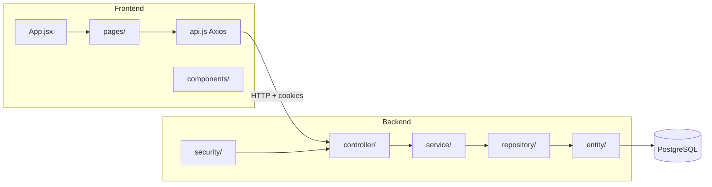
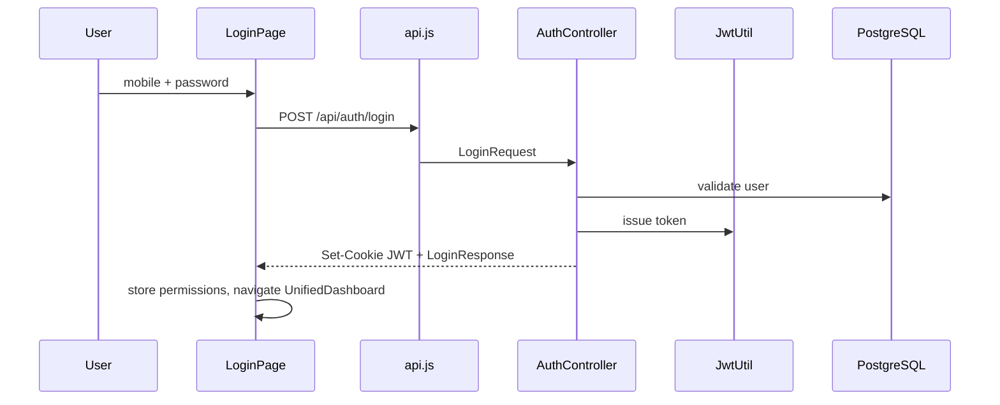

# System Architecture

## System Overview

Monolithic **Spring Boot backend** + **React SPA frontend**, deployed locally via Docker Compose. Stateless JWT auth (cookie-based) with Spring Security filter chain. PostgreSQL for persistence. STOMP WebSocket for chat.

## Architecture Diagram

## Component Descriptions

### Backend packages (`com.clinic.hms`)

| Package | Purpose | Count (approx) |
|---------|---------|----------------|
| `controller/` | REST endpoints | 22 controllers |
| `service/` | Business logic | 14+ services |
| `repository/` | Spring Data JPA | 30+ repositories |
| `entity/` | JPA models | 40+ entities |
| `dto/request`, `dto/response` | API contracts | 50+ DTOs |
| `security/` | JWT, filters, SecurityConfig | 6 classes |
| `config/` | Seeders, Jackson, WebSocket | 5 classes |
| `exception/` | GlobalExceptionHandler | 1 advice class |

### Frontend (`frontend/src/`)

| Folder | Purpose |
|--------|---------|
| `pages/` | Route-level views (patient, doctor, billing, etc.) |
| `components/` | Reusable UI (layout, billing, chat, odontogram, print) |
| `api/` | Axios client with interceptors |
| `hooks/` | Custom hooks (notifications) |
| `utils/` | dateFormat, initials, patientList |

## Data Flow (Login → Dashboard)

## Integration Points

- **External APIs**: None in dev (self-contained HMS)
- **Database**: PostgreSQL (`clinic_hms`)
- **WebSocket**: `/ws` STOMP for chat
- **Swagger**: `/swagger-ui.html` for API docs

## Infrastructure

- **Docker Compose**: postgres + backend + frontend
- **Backend Dockerfile**: Multi-stage Java 21 build
- **Frontend Dockerfile**: Node build + nginx serve
