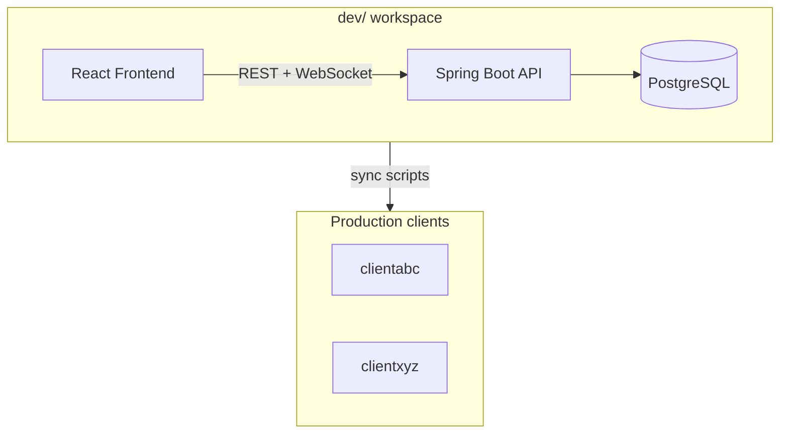

# Business Overview

## Business Context

DiziDental Dev is the local development environment for a **multi-client Hospital Management System (HMS)** serving dental/clinic operations. Code developed here is synced to production client folders (`clientabc`, `clientxyz`) via scripts.

## Business Description

- **Purpose**: End-to-end clinic operations — patient registration, visits, appointments, clinical exams, treatment plans, prescriptions, billing, inventory, labs, internal chat, and role-based dashboards for doctors, patients, org admins, and super admins.
- **Multi-tenancy**: Organization-scoped data via `X-Active-Org-Id` header and org-linked entities.

## Business Transactions

| Transaction | Primary modules |
|-------------|-----------------|
| Patient registration & lookup | PatientController, PatientService |
| Visit lifecycle | VisitController, VisitService |
| Appointment scheduling | AppointmentController, AppointmentService |
| Clinical exam & diagnosis | VisitExamService, VisitDiagnosisService |
| Treatment planning | TreatmentPlanController, TreatmentPlanService |
| Prescriptions | PrescriptionController, PrescriptionService |
| Billing & payments | BillingController, BillingService |
| Inventory & vendors | InventoryController, VendorController |
| Lab orders | LabController, LabService |
| Real-time chat | ChatController, ChatWebSocketController |
| Auth & permissions | AuthController, SecurityConfig, ModulePermission |
| Reporting | PatientReportController, RevenueReportController, AppointmentReportController |

## Business Dictionary

| Term | Meaning |
|------|---------|
| Org / Organization | Clinic or hospital tenant |
| Visit | Patient encounter session |
| Service Provider | External lab, pharmacy, or bed provider portal |
| Module Permission | Feature flag per role (e.g., billing, schedule) |
| Super Admin | Platform-level administrator |

## Component Level Descriptions

### Backend (`backend/`)
REST API and WebSocket server implementing all clinic business rules, persistence, and security.

### Frontend (`frontend/`)
React SPA with role-aware dashboards (UnifiedDashboard), patient/doctor/org/super-admin views.

### Database
PostgreSQL with JPA entities; seed scripts for treatment/exam master data.
