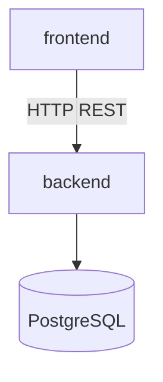

# Dependencies

## Internal Dependencies

- Frontend depends on backend API only (no shared npm/java package)
- Backend is self-contained monolith

## External Dependencies (key)

### Backend (`build.gradle`)
- spring-boot-starter-webmvc, data-jpa, security, websocket, validation, actuator
- jjwt-api/impl/jackson 0.11.5
- postgresql (runtime)
- springdoc-openapi 2.8.14
- lombok

### Frontend (`package.json`)
- react, react-dom, react-router-dom
- axios
- @stomp/stompjs, sockjs-client
- html2canvas, jspdf, raphael (odontogram/print)

## Cross-cutting

- `.understand-anything/knowledge-graph.json` — codebase map for AI agents (not runtime dependency)
